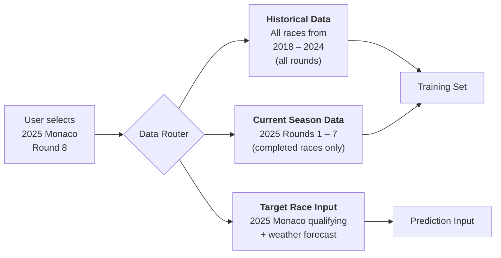

# Formula 1 Race Prediction — Product Requirements Document

**Version:** 1.1  
**Date:** 2026-03-10  
**Author:** AI-Assisted  
**Status:** Draft

---

## 1. Executive Summary

Build a **Jupyter Notebook** that uses the **FastF1** library to collect historical Formula 1 data and **scikit-learn** machine learning models to predict race outcomes. The user **selects which specific race** they want to predict; the notebook then automatically assembles training data from **all previous races in that season** plus **all historical data from prior seasons**, trains models, and outputs predictions for the chosen event. The notebook will serve as an end-to-end, reproducible data science project — from user input and data ingestion through feature engineering, model training, evaluation, and interactive prediction.

---

## 2. Goals & Objectives

| # | Goal                                                                                 |
|---|--------------------------------------------------------------------------------------|
| 1 | Let the user **select a target race** (year + Grand Prix) to predict                 |
| 2 | **Dynamically scope** training data: all prior races that season + all historical seasons |
| 3 | Engineer predictive features from lap times, qualifying, telemetry, weather, and tyre data |
| 4 | Train and compare multiple scikit-learn models for each prediction task               |
| 5 | Produce clear, well-visualised evaluation results and model explainability            |
| 6 | Output race predictions for the user-selected event                                  |

---

## 3. Target Audience

- F1 enthusiasts interested in data-driven analysis  
- Data science learners looking for a real-world project  
- Sports analytics researchers and hobbyists  

---

## 4. User Input — Race Selection

The notebook begins with an **interactive input cell** where the user specifies which race to predict.

### 4.1 Input Parameters

| Parameter          | Type       | Example              | Description                                                                   |
|--------------------|------------|----------------------|-------------------------------------------------------------------------------|
| `target_year`      | `int`      | `2025`               | Season year (2018 – current)                                                  |
| `target_race`      | `str`      | `"Monaco"`           | Grand Prix name or round number                                               |

### 4.2 Input Method

The notebook will use **IPython widgets** (`ipywidgets`) for a dropdown-based selection flow:

1. **Year dropdown** — populated with all available seasons (2018 – current year).  
2. **Race dropdown** — dynamically populated via `fastf1.get_event_schedule(target_year)` after the year is selected, showing all Grand Prix names for that season.  
3. **Confirm button** — locks in the selection and triggers the data pipeline.

```python
# Example input cell
import ipywidgets as widgets
import fastf1

year_dropdown = widgets.Dropdown(
    options=list(range(2018, 2026)),
    value=2025,
    description='Season:'
)

# Populated on year change
schedule = fastf1.get_event_schedule(year_dropdown.value)
race_dropdown = widgets.Dropdown(
    options=schedule['EventName'].tolist(),
    description='Grand Prix:'
)
```

> [!TIP]
> Users can also directly set variables (`TARGET_YEAR = 2025`, `TARGET_RACE = "Monaco"`) at the top of the notebook for non-interactive / script-based runs.

### 4.3 Input Validation

| Check                                      | Action on Failure                                          |
|--------------------------------------------|------------------------------------------------------------|
| Year outside 2018 – current                | Raise `ValueError` with supported range                    |
| Race name not found in schedule             | Display fuzzy-match suggestions via `difflib.get_close_matches` |
| Target race is Round 1 of its season        | Warn that no in-season data exists; train on history only  |
| Qualifying data not yet available           | Inform user and offer to predict with practice data only   |

---

## 5. Dynamic Data Scoping

Once the user selects a target race, the notebook **automatically determines** which data to use for training and which to use as the prediction input.

### 5.1 Data Partitioning Logic



### 5.2 Training Data Composition

| Segment                  | Data Included                                                      | Purpose                                              |
|--------------------------|--------------------------------------------------------------------|------------------------------------------------------|
| **Historical seasons**   | All completed race results from 2018 up to `target_year - 1`      | Broad baseline covering diverse conditions           |
| **Current season (pre-target)** | All completed races in `target_year` before `target_round`  | Captures current-season form, car performance, driver transfers |

### 5.3 Prediction Input Data

| Data                            | Source                                         | Fallback                                   |
|---------------------------------|------------------------------------------------|--------------------------------------------|
| Grid positions & qualifying     | Target race qualifying session                 | FP3 results or championship standings      |
| Weather conditions               | Target race weather data (if session occurred) | Historical averages for that circuit       |
| Driver & team current-season stats | Cumulative from current-season segment       | Previous-season end-of-year stats          |

### 5.4 Edge Cases

| Scenario                                  | Handling                                                              |
|-------------------------------------------|-----------------------------------------------------------------------|
| **Round 1 prediction** (no prior races)   | Training uses only historical seasons; warn user about limited season context |
| **Past race** (result already exists)     | Train on data strictly before that race; compare prediction to actual result |
| **Future race** (qualifying not happened) | Use championship standings as grid proxy; mark results as tentative   |
| **New driver / team**                     | Impute features from historical rookie averages or team predecessor   |

> [!IMPORTANT]
> To prevent **data leakage**, the pipeline enforces a strict temporal cutoff: no information from the target race or any race after it is ever included in the training data.

---

## 6. Prediction Tasks

The notebook will address **three tiers** of prediction:

### 6.1 Race Finishing Position (Regression)
Predict the **finishing position** (1–20) of each driver in a race.

### 6.2 Podium Finish (Binary Classification)
Predict whether a driver will finish in the **top 3**.

### 6.3 Points Finish (Binary Classification)
Predict whether a driver will finish in the **top 10** (points-scoring position).

> [!NOTE]
> All three tasks will share the same feature set but use task-appropriate models and evaluation metrics.

---

## 7. Data Source — FastF1

### 7.1 Library Overview

| Attribute              | Details                                                                      |
|------------------------|------------------------------------------------------------------------------|
| **Package**            | `fastf1` (PyPI)                                                              |
| **Data back-end**      | Jolpica-F1 API (Ergast-compatible) + official F1 live timing                 |
| **Season coverage**    | Full timing/telemetry from **2018 onwards**; limited results for older years |
| **Data format**        | Extended Pandas DataFrames                                                   |
| **Caching**            | Built-in local disk cache to avoid redundant API calls                       |

### 7.2 Data Categories & Key Columns

| Category          | FastF1 Method / Property                  | Key Fields                                                                      |
|-------------------|-------------------------------------------|---------------------------------------------------------------------------------|
| **Session Info**   | `fastf1.get_session()`                    | Year, Grand Prix name, session type (FP1-3, Q, R)                               |
| **Results**        | `session.results`                         | DriverNumber, Abbreviation, TeamName, Position, GridPosition, Points, Status     |
| **Lap Data**       | `session.laps`                            | LapTime, LapNumber, Sector1/2/3Time, Compound, TyreLife, IsPersonalBest, Stint   |
| **Telemetry**      | `lap.get_telemetry()`                     | Speed, RPM, Gear, Throttle, Brake, DRS, nGear (≈10 Hz)                          |
| **Weather**        | `session.weather_data`                    | AirTemp, TrackTemp, Humidity, Pressure, WindSpeed, WindDirection, Rainfall       |
| **Event Schedule** | `fastf1.get_event_schedule(year)`         | EventName, Country, Location, EventDate, EventFormat                            |

### 7.3 Data Collection Scope (Dynamic)

The data collected depends on the user's race selection (see §4–5).

| Parameter       | Value                                                           |
|-----------------|-----------------------------------------------------------------|
| Seasons         | 2018 up to `target_year`                                        |
| Rounds          | All rounds in historical seasons; rounds `< target_round` in current season |
| Sessions        | Qualifying (Q) + Race (R)                                       |
| Drivers         | All starters per session                                        |
| Estimated rows  | ~15,000–20,000 driver-race rows (varies by target race round)   |

---

## 8. Feature Engineering

### 6.1 Driver & Grid Features

| Feature                     | Source               | Description                                               |
|-----------------------------|----------------------|-----------------------------------------------------------|
| `grid_position`             | Results              | Starting grid position                                    |
| `qualifying_time_delta`     | Qualifying laps      | Gap to pole position (seconds)                            |
| `driver_season_points`      | Results (cumulative) | Driver championship points heading into the race          |
| `driver_recent_form`        | Results (rolling)    | Avg. finishing position over last 5 races                 |
| `driver_track_history`      | Results (filtered)   | Avg. finishing position at this specific circuit           |

### 6.2 Team Features

| Feature                     | Source               | Description                                               |
|-----------------------------|----------------------|-----------------------------------------------------------|
| `constructor_season_points` | Results (cumulative) | Team championship points heading into the race            |
| `team_reliability_rate`     | Results (status)     | % of races finished without mechanical DNF (rolling)      |
| `teammate_grid_diff`        | Results              | Grid position difference to teammate                      |

### 6.3 Pace Features

| Feature                     | Source                   | Description                                           |
|-----------------------------|--------------------------|-------------------------------------------------------|
| `avg_race_lap_time`         | Lap data (prev. races)   | Avg. race lap time (rolling 3 races)                  |
| `best_sector_times`         | Qualifying laps          | Best S1 / S2 / S3 from qualifying                     |
| `practice_pace_rank`        | FP2 laps (optional)      | Rank by median lap time in FP2 long runs              |

### 6.4 Tyre & Strategy Features

| Feature                     | Source         | Description                                                 |
|-----------------------------|----------------|-------------------------------------------------------------|
| `starting_compound`         | Lap data       | Tyre compound used at race start (soft/medium/hard)         |
| `avg_stint_length`          | Lap data       | Historical average stint length for driver/team              |
| `num_pit_stops`             | Lap data       | Number of pit stops (historical avg. at circuit)            |

### 6.5 Weather Features

| Feature                     | Source        | Description                                                  |
|-----------------------------|---------------|--------------------------------------------------------------|
| `air_temp`                  | Weather data  | Air temperature at session start                             |
| `track_temp`                | Weather data  | Track temperature at session start                           |
| `is_wet`                    | Weather data  | Boolean: Rainfall > 0 at any point during the session        |
| `wind_speed`                | Weather data  | Average wind speed during session                            |

### 6.6 Circuit Features

| Feature                     | Source            | Description                                              |
|-----------------------------|-------------------|----------------------------------------------------------|
| `circuit_type`              | Manual / lookup   | Categorical: street / permanent / hybrid                 |
| `circuit_length_km`         | Event schedule    | Circuit lap length                                       |
| `total_race_laps`           | Event schedule    | Number of laps in race                                   |

---

## 9. Model Selection & Rationale

### 7.1 Regression Models (Finishing Position Prediction)

| Model                        | scikit-learn Class              | Why This Model?                                                                                       |
|------------------------------|---------------------------------|-------------------------------------------------------------------------------------------------------|
| **Ridge Regression**         | `Ridge`                         | Regularised linear baseline; handles multicollinearity among correlated features (grid, points, pace)  |
| **Random Forest Regressor**  | `RandomForestRegressor`         | Captures non-linear interactions (e.g., weather × tyre choice) without extensive feature transformation |
| **Gradient Boosting Regressor** | `GradientBoostingRegressor`  | Sequential error-correction yields strong tabular-data performance; good with mixed feature types       |
| **Stacking Regressor**       | `StackingRegressor`             | Meta-learner that combines Ridge + RF + GB to reduce individual model weaknesses                       |

### 7.2 Classification Models (Podium / Points Finish)

| Model                        | scikit-learn Class              | Why This Model?                                                                                       |
|------------------------------|---------------------------------|-------------------------------------------------------------------------------------------------------|
| **Logistic Regression**      | `LogisticRegression`            | Strong probabilistic baseline; interpretable coefficients; fast training                              |
| **Random Forest Classifier** | `RandomForestClassifier`        | Robust ensemble that handles mixed features and resists overfitting with default hyperparameters       |
| **Gradient Boosting Classifier** | `GradientBoostingClassifier` | State-of-the-art for structured data; handles class imbalance (few podium finishers) well with tuning |
| **Support Vector Classifier** | `SVC(probability=True)`        | Effective with high-dimensional feature spaces; kernel trick captures complex decision boundaries      |

### 7.3 Hyperparameter Tuning Strategy

- Use **`GridSearchCV`** or **`RandomizedSearchCV`** with 5-fold **time-series–aware cross-validation** (split by season/round to avoid data leakage).  
- Key hyperparameters to tune:

| Model              | Hyperparameters                                             |
|---------------------|-------------------------------------------------------------|
| Ridge               | `alpha`                                                     |
| Random Forest       | `n_estimators`, `max_depth`, `min_samples_split`            |
| Gradient Boosting   | `n_estimators`, `learning_rate`, `max_depth`, `subsample`   |
| SVC                 | `C`, `kernel`, `gamma`                                      |
| Logistic Regression | `C`, `solver`, `class_weight`                               |

---

## 10. Evaluation Metrics

### 8.1 Regression Metrics

| Metric                          | Description                                        |
|---------------------------------|----------------------------------------------------|
| **MAE** (Mean Absolute Error)    | Average position error — intuitive, human-readable |
| **RMSE** (Root Mean Squared Error) | Penalises large errors more heavily               |
| **R² Score**                     | Proportion of variance explained                   |

### 8.2 Classification Metrics

| Metric             | Description                                                                   |
|--------------------|-------------------------------------------------------------------------------|
| **Accuracy**       | Overall correct predictions                                                   |
| **Precision**      | Of predicted podium/points, how many were correct                             |
| **Recall**         | Of actual podium/points, how many were captured                               |
| **F1 Score**       | Harmonic mean of Precision & Recall — key metric for imbalanced classes       |
| **ROC-AUC**        | Discrimination ability across all probability thresholds                      |

### 8.3 Model Comparison

Present a **consolidated comparison table** and **bar chart** showing all models side-by-side on the primary metric (MAE for regression, F1 for classification).

---

## 11. Notebook Structure

The Jupyter notebook will be organised into clearly numbered sections:

```
f1_race_predictions.ipynb
│
├── 1. Introduction & Setup
│   ├── Project overview
│   ├── pip install & imports
│   └── FastF1 cache configuration
│
├── 2. Race Selection (User Input)          ◀── NEW
│   ├── Year & Grand Prix dropdowns (ipywidgets)
│   ├── Input validation & schedule display
│   └── Compute target_year, target_race, target_round
│
├── 3. Dynamic Data Collection              ◀── UPDATED
│   ├── Fetch historical seasons (2018 → target_year - 1)
│   ├── Fetch current-season races (rounds < target_round)
│   ├── Fetch target race qualifying (prediction input)
│   └── Aggregate into master DataFrame
│
├── 4. Exploratory Data Analysis (EDA)
│   ├── Distribution of finishing positions
│   ├── Grid vs. finish position correlation
│   ├── Lap time trends across seasons
│   ├── Weather impact visualisation
│   └── Feature correlation heatmap
│
├── 5. Feature Engineering
│   ├── Compute all features from §8
│   ├── Handle missing values
│   ├── Encode categoricals (OneHotEncoder / OrdinalEncoder)
│   └── Feature scaling (StandardScaler)
│
├── 6. Model Training — Regression
│   ├── Time-series–aware train/test split
│   ├── Train Ridge, RF, GB, Stacking
│   ├── Hyperparameter tuning (RandomizedSearchCV)
│   └── Evaluation on test set
│
├── 7. Model Training — Classification
│   ├── Create binary targets (podium, points)
│   ├── Train LR, RF, GB, SVC
│   ├── Hyperparameter tuning
│   └── Evaluation on test set
│
├── 8. Model Comparison & Explainability
│   ├── Side-by-side metric comparison
│   ├── Feature importance plots (RF / GB)
│   ├── Partial dependence plots
│   └── Best model selection rationale
│
├── 9. Predict Selected Race                ◀── UPDATED
│   ├── Build feature vector from target race qualifying
│   ├── Predict with best model
│   ├── Display predicted finishing order
│   └── If past race: compare prediction vs. actual result
│
└── 10. Conclusion & Next Steps
    ├── Summary of findings
    ├── Limitations & caveats
    └── Ideas for improvement (XGBoost, neural nets, live data)
```

---

## 12. Technology Stack

| Component          | Technology                                    |
|--------------------|-----------------------------------------------|
| Language           | Python 3.10+                                  |
| Notebook           | Jupyter Notebook / JupyterLab                 |
| F1 Data            | `fastf1` (latest stable)                      |
| ML Framework       | `scikit-learn` ≥ 1.3                          |
| Data Manipulation  | `pandas`, `numpy`                             |
| Visualisation      | `matplotlib`, `seaborn`                       |
| Interactive Input  | `ipywidgets`                                  |
| Serialisation      | `joblib` (model persistence)                  |
| Environment        | `venv` or `conda`                             |

---

## 13. Dependencies & Installation

```bash
pip install fastf1 scikit-learn pandas numpy matplotlib seaborn joblib ipywidgets jupyterlab
```

---

## 14. Project File Structure

```
formula1-predictions/
├── f1_race_predictions.ipynb      # Main notebook
├── requirements.txt               # Pinned dependencies
├── README.md                      # Project overview & quickstart
├── PRD.md                         # This document
├── data/
│   └── cache/                     # FastF1 cache directory
├── models/
│   ├── best_regressor.pkl         # Serialised best regression model
│   └── best_classifier.pkl        # Serialised best classification model
└── utils/
    ├── data_loader.py             # Functions to fetch & cache F1 data
    ├── feature_engineering.py     # Feature computation pipeline
    └── evaluation.py              # Metric computation & plotting helpers
```

---

## 15. Non-Functional Requirements

| Requirement         | Description                                                     |
|---------------------|-----------------------------------------------------------------|
| Reproducibility     | Random seeds set everywhere; cache ensures identical data pulls |
| Performance         | Full pipeline should run in < 30 min on commodity hardware      |
| Caching             | FastF1 cache must be enabled to avoid rate limiting             |
| Documentation       | Each notebook cell should have a markdown header explaining intent |
| Extensibility       | Utility modules allow easy addition of new features or models   |

---

## 16. Risks & Mitigations

| Risk                                         | Impact   | Mitigation                                                          |
|----------------------------------------------|----------|---------------------------------------------------------------------|
| FastF1 API rate-limiting / downtime           | High     | Enable local disk cache; include pre-cached fallback dataset        |
| Class imbalance (few podium finishers)        | Medium   | Use `class_weight='balanced'`; evaluate with F1 / ROC-AUC          |
| Data leakage from future-looking features     | High     | Strict time-series split; no look-ahead in rolling computations     |
| Telemetry data volume too large               | Medium   | Aggregate telemetry into summary stats; do not store raw telemetry  |
| Regulation changes across seasons             | Low      | Include season as a feature; document known regulation shifts       |

---

## 17. Success Criteria

| Metric                               | Target                            |
|---------------------------------------|-----------------------------------|
| Finishing position MAE                | ≤ 3.5 positions                  |
| Podium prediction F1 Score            | ≥ 0.60                           |
| Points-finish prediction F1 Score     | ≥ 0.70                           |
| Notebook runs end-to-end without error | ✅                                |
| All visualisations render correctly    | ✅                                |

---

## 18. Future Enhancements

- **XGBoost / LightGBM** — Gradient boosting frameworks with better performance on large tabular data  
- **Deep Learning** — LSTM / Transformer models for sequential race-by-race prediction  
- **Live Predictions** — Integration with real-time FastF1 data during race weekends  
- **Deployment** — Streamlit or Gradio dashboard for interactive predictions  
- **Pit Strategy Prediction** — Predict optimal pit-stop windows using tyre degradation data  
- **Safety Car Probability** — Binary classification for safety car deployment likelihood  

---

## 19. References

- [FastF1 Documentation](https://docs.fastf1.dev/)
- [FastF1 GitHub](https://github.com/theOehrly/Fast-F1)
- [scikit-learn User Guide](https://scikit-learn.org/stable/user_guide.html)
- [Jolpica-F1 API](https://github.com/jolpica/jolpica-f1)
